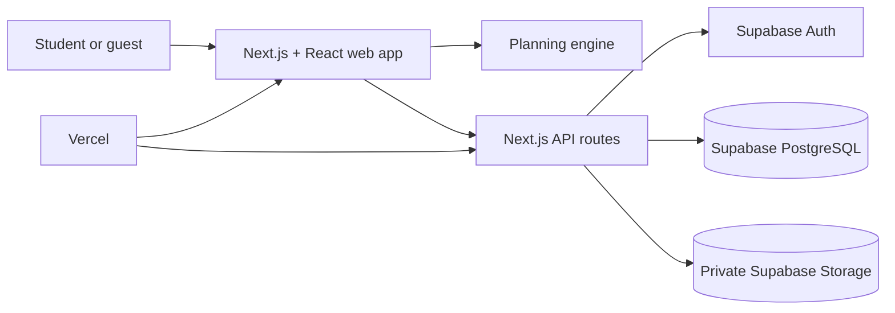

# **LoadLess by Suasana**

**Team:** NIK MUHAMMAD FARIS BIN NIK ZAKI, AKMA IZZUDDIN BIN AZMAN, MUHAMMAD ADAM ISKANDAR BIN MUHAMMAD REDZUAN,ADAM HARRAZ BIN HAZRUL

**Problem Statement:** Stress & Workload Manager&nbsp;

**Video Presentation:** [Watch the LoadLess presentation](https://youtu.be/cb2xIlNud_A?si=Oz8hP3UXNET6iK4h)

**Presentation Slides:** [https://canva.link/0nm3fnvq8iq9zqk](https://canva.link/0nm3fnvq8iq9zqk)

## **1\. Project Overview**

**Problem**

Students have many things to manage: assignments, deadlines, classes, work, sleep, and time with friends. Normal to-do lists and calendars show what needs to be done, but they do not show if there is enough time to finish everything. This can cause stress, missed deadlines, and burnout.

The main users are students. Friends, classmates, and teachers can also benefit because they can support students and help them manage their workload.

Apps like Todoist, Google Calendar, and Notion help users list tasks and events, but they do not plan work around a student’s energy, routine, and wellbeing. Social media apps like Instagram are fun and engaging, but they can be distracting and create pressure instead of helping students stay balanced.

**Solution**

LoadLess is a student workload, wellbeing, and social connection app that helps students make realistic plans for each day. It uses task deadlines, estimated work time, priorities, routines, and daily stress and energy check-ins to schedule focus blocks around real commitments. When work cannot fit, LoadLess clearly flags the overload and encourages students to review their priorities, scope, or recovery time. Its social community lets students share progress, small wins, and recovery moments so planning feels motivating rather than isolating.

&nbsp;

&nbsp;

**Feature Set**

* Task creation, editing, completion, deletion, and priority management
* Deadlines, estimated duration, difficulty, and task categories
* Routine scheduling for classes, sleep, meals, work, and exercise
* Daily stress and energy check-ins
* Energy-aware focus plans with breaks
* Overload warnings, urgent-gap alerts, and suggested task start times
* Workload dashboard, progress tracking, and time insights
* Recovery activity logging and evening reflections
* Shareable weekly recap cards
* Community social feed with posts, optional images, likes, and comments
* User profiles, following, and friend requests
* “Free Together” matching for selected shared free-time windows
* Study, meal, walk, movie, and hangout invitations
* JSON export and saved user data

&nbsp;

## **2\. Ideation & Process**

### **2.1 Ideas We Considered**

Table of every distinct idea generated, with why each was kept or dropped, order it so that chosen ideas are listed first

| Idea | Why it was dropped / kept |
| :---- | :---- |
| Smart workload planner&nbsp; | **Kept.** Students need help turning tasks and deadlines into a realistic plan.&nbsp; |
| Stress and energy check-ins&nbsp; | **Kept.** A student’s energy changes each day, so the plan should be flexible&nbsp; |
| Routine planner&nbsp; | **Kept.** Classes, sleep, meals, work, and exercise should be protected before adding tasks&nbsp; |
| Social feed for student updates&nbsp; | **Kept.** Sharing progress, small wins, and recovery moments makes the app more motivating and less lonely&nbsp; |
| Friends’ free-time matching&nbsp; | **Kept.** It helps students make time for study sessions, meals, walks, and hangouts.&nbsp; |
| Basic to-do list only&nbsp; | **Dropped.** Many apps already offer this, but they do not solve the problem of unrealistic workload.&nbsp; |
| Automatic deadline changes&nbsp; | **Dropped.** The app should warn students about overload, but students should control their own deadlines and decisions&nbsp; |

### **2.2 Ideation Boards**

Our initial idea was a basic to-do list for students to manage tasks, deadlines, and priorities. However, we realised that this idea was too common and did not fully solve the problem of students feeling overwhelmed.

We developed the idea by adding workload planning based on task estimates, routines, stress, and energy levels. This allowed LoadLess to create a more realistic plan around classes, sleep, meals, work, and other commitments.

After mentor feedback, we were told that the planner alone was not unique enough and that the interface felt too wordy. Therefore, we added a social community feature with posts, photos, likes, comments, friends, and shared progress. We also improved the UI by using clearer cards, icons, colours, and simpler text.

Some ideas were dropped, including full calendar sharing, automatic deadline changes, and competitive leaderboards. These were removed because they could affect privacy, reduce user control, or create unhealthy pressure.

&nbsp;

![][image1]

&nbsp;

&nbsp;

&nbsp;

&nbsp;

&nbsp;

&nbsp;

&nbsp;

&nbsp;

&nbsp;

&nbsp;

### **2.3 Mentor Consultation**

| Date | Mentor | Feedback Received | What Was Changed |
| :---- | :---- | :---- | :---- |
| 10/9/26 | Faris Imran | The original workload planner idea was too common and did not feel unique enough.&nbsp; | We added a social community feature where students can post updates, share small wins, react, comment, follow friends, and support each other.&nbsp; |
| 10/9/26 | Faris Imran | The first UI had too much text and felt boring.&nbsp; | We simplified the wording, improved the visual layout, used clearer cards, icons, colours, and shorter actions to make the app feel more engaging and easier to use.&nbsp; |

&nbsp;

## **3\. Design & Prototype**

**UI Prototype:** [Open the live LoadLess app](https://loadless-seven.vercel.app/)

**Home Page**

![][image2]

&nbsp;

**Dashboard**

![][image3]

**Task**![][image4]

&nbsp;

&nbsp;

&nbsp;

&nbsp;

**Plan**![][image5]

**Wellbeing**![][image6]

**Routine**![][image7]

&nbsp;

## **4\. What Makes It Different**

| Novel Feature&nbsp; | Original Idea / Twist&nbsp; |
| :---- | :---- |
| Social productivity feed&nbsp; | Students can share study updates, small wins, recovery activities, reflections, and photos. The twist is using an engaging social-media style feed for healthy student motivation instead of distraction.&nbsp; |
| Balance-focused posts&nbsp; | LoadLess encourages users to share rest, walks, meals, hobbies, and recovery \- not only completed assignments. This makes wellbeing feel like progress too.&nbsp; |
| Free time together | Students share only selected free-time windows, then find overlaps with friends for study sessions, meals, walks, movies, or hangouts. The twist is protecting privacy by not sharing a full calendar.&nbsp; |
| Energy-aware planner&nbsp; | The daily plan changes according to the student’s stress and energy check-in. This makes planning more realistic than a normal fixed task list.&nbsp; |
| Routine-first scheduling&nbsp; | LoadLess protects classes, sleep, meals, work, and exercise before placing focus blocks. The app plans around real life instead of assuming the student is free all day.&nbsp; |

&nbsp;

&nbsp;

## **5\. Technical Architecture & Feasibility**

**Tech stack**

**Frontend:** We use Next.js, React, and TypeScript to build the LoadLess web app. React powers interactive pages such as the task planner, wellbeing check-in, dashboard, and social feed, while TypeScript helps reduce coding errors. The responsive interface works on desktop and mobile screens.

**Styling and UI:** We use Tailwind CSS, Shadcn UI, and Lucide Icons. These tools help us create a clean and modern interface quickly. The main challenge is avoiding too much text and keeping the design easy for students to understand.

**Backend:** We use Next.js server routes deployed as Vercel Functions. They handle data validation, planner storage, social posts, comments, friend requests, and availability sharing. The planning engine itself uses transparent client-side rules so suggestions update immediately.

**Database:** We use Supabase PostgreSQL to store user profiles, planner data, tasks, routines, posts, comments, likes, friends, free-time availability, and invitations. Each signed-in user has a separate planner record.

**Media Storage:** We use a private Supabase Storage bucket for images uploaded to social posts. Images are served through protected application routes instead of exposing the storage bucket publicly.

**APIs and Services:** LoadLess uses Supabase Auth for member accounts and its own validated API routes for planner and social features. The public judging link opens a browser-local guest workspace, while account data and social write operations remain protected.

**Hosting:** LoadLess is deployed on Vercel from the GitHub `main` branch. Every accepted update triggers a production build, making the prototype easy to share with testers and judges.&nbsp;

**System architecture diagram**

**Build plan & scope**

During the building phase, we will focus on completing and testing the main LoadLess experience.

First, we will finish the core planner. Students will be able to add tasks with deadlines, estimated time, priority, and difficulty. They will also add routines such as classes, sleep, meals, work, and exercise. LoadLess will use this information, together with daily stress and energy check-ins, to create a realistic daily plan and show overload warnings.

Second, we will complete the social community features. Students will be able to create profiles, post study updates or recovery moments, upload optional images, like and comment on posts, and connect with friends. We will also complete the “Free Together” feature, where students share selected free-time windows and send invitations for studying, meals, walks, or hangouts.

Finally, we will test the app on desktop and mobile screens, improve the UI based on feedback, and deploy a public version for judges. We will focus on a small number of reliable features rather than adding too many extra tools. Features such as full calendar sync, automatic deadline changes, competitive leaderboards, and medical stress diagnosis will remain out of scope.

&nbsp;

&nbsp;

&nbsp;

&nbsp;

[image1]: docs/images/image1.png

[image2]: docs/images/image2.png

[image3]: docs/images/image3.png

[image4]: docs/images/image4.png

[image5]: docs/images/image5.png

[image6]: docs/images/image6.png

[image7]: docs/images/image7.png
